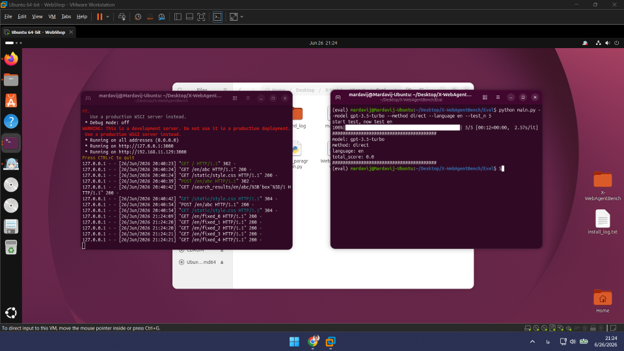
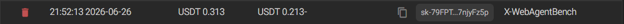
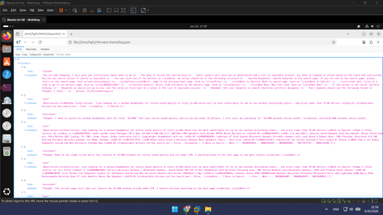
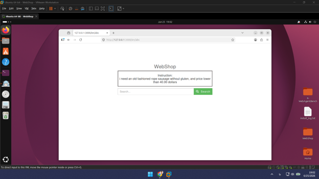
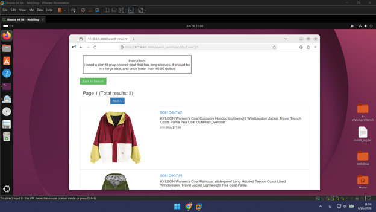

<h1 dir="rtl">امکان‌سنجی پروپوزال</h1>

<div dir="rtl">

**موضوع:** فارسی‌سازی محیط تجارت الکترونیک X-WebAgentBench و ارزیابی عامل‌ها

**تاریخ:** تیر ۱۴۰۴

</div>

---

<h2 dir="rtl">فهرست مطالب</h2>

<div dir="rtl">

1. [خلاصه اجرایی](#خلاصه-اجرایی)
2. [آزمایش‌های اولیه](#آزمایش‌های-اولیه)
3. [انگیزه و اهمیت موضوع](#انگیزه-و-اهمیت-موضوع)
4. [محیط آزمایش: WebShop](#محیط-آزمایش) — سوالات ۱، ۲، ۳، ۴، ۱۴، ۱۵
5. [بنچمارک مرجع: X-WebAgentBench](#بنچمارک-مرجع) — سوالات ۹، ۱۰، ۱۱، ۱۲، ۱۳
6. [روش پیشنهادی: فارسی‌سازی و سه رویکرد ارزیابی](#روش-پیشنهادی) — سوالات ۵، ۶، ۷، ۱۶
7. [ارزیابی و معیارها](#ارزیابی-و-معیارها) — سوال ۸
8. [هزینه‌ها](#هزینه‌ها) — سوالات ۱۷، ۱۸، ۱۹، ۲۰
9. [اعتبارسنجی و محدودیت‌ها](#اعتبارسنجی) — سوالات ۲۱، ۲۲

</div>

---

<h2 dir="rtl" id="خلاصه-اجرایی">۱. خلاصه اجرایی</h2>

<div dir="rtl">

این گزارش امکان‌سنجی پاسخی به سوالات فنی و عملی پروپوزال پژوهشی است که هدف آن ساخت اولین بنچمارک فارسی برای ارزیابی عامل‌های LLM در محیط خرید وب است. این کار با گسترش X-WebAgentBench (ACL 2025) به زبان فارسی انجام می‌شود — زبانی که در آن بنچمارک غایب است.

**محورهای اصلی پروپوزال:**
1. فارسی‌سازی دیتاست X-WebAgentBench از طریق ترجمه
2. مقایسه عملکرد عامل در سه رویکرد: **direct**، **ReAct**، و **HTML Pruning**
3. گزارش Task Score و Success Rate به‌عنوان معیار ارزیابی

**نتیجه کلی امکان‌سنجی:** پروژه از نظر فنی کاملاً **امکان‌پذیر** است. زیرساخت X-WebAgentBench با حداقل تغییر می‌تواند زبان فارسی را پشتیبانی کند. هزینه‌های ترجمه و اجرا قابل پیش‌بینی و کنترل‌پذیر هستند — **مشروط به اینکه روش اصلی مقاله مرجع با مدل‌های سبک‌تر جایگزین شود**؛ تکرار عین روش (GPT-4o برای ترجمه ۵۸۹٬۹۴۶ محصول به ۱۴ زبان) بالغ بر ۵۰۰۰ دلار هزینه دارد و توجیه‌پذیر نیست. این جایگزینی یک محدودیت اعتبارسنجی ایجاد می‌کند: مقایسه مستقیم با اعداد مقاله مرجع نیازمند تأیید کیفیت ترجمه از طریق بازبینی انسانی نمونه‌ای است — اگر کیفیت داده تأیید شود، ضعف عملکرد عامل به داده نسبت داده نمی‌شود (جزئیات در بخش ۵.۲ و ۹.۲). تنها محدودیت جدی دیگر، عدم قابلیت جایگزینی مستقیم دیتای دیجی‌کالا در این محیط است که در بخش ۹ تحلیل شده.

</div>

---

<h2 dir="rtl" id="آزمایش‌های-اولیه">۲. آزمایش‌های اولیه</h2>

<div dir="rtl">

پیش از طراحی نهایی پروپوزال، سه آزمایش عملی برای تأیید امکان‌پذیری فنی انجام شد. تمام آزمایش‌ها روی **یک تسک واحد** اجرا شدند تا هزینه و زمان کنترل شود.

</div>

---

<h3 dir="rtl">۲.۱ تست محیط WebShop از طریق X-WebAgentBench</h3>

<div dir="rtl">

محیط WebShop از طریق ریپوی رسمی X-WebAgentBench نصب و راه‌اندازی شد. سرور Flask روی localhost بالا آمد و endpoint‌های جستجو، صفحه محصول، و خرید بدون مشکل پاسخ دادند.

این مرحله تأیید کرد که زیرساخت بنچمارک بدون نیاز به تغییر قابل اجرا است.

</div>

<div dir="rtl">


*تصویر ۵: نحوه اجرای آزمایش — ترمینال سمت چپ محیط WebShop را روی پورت ۳۰۰۰ آماده می‌کند، ترمینال سمت راست کدهای evaluation را اجرا می‌کند*

</div>

---

<h3 dir="rtl">۲.۲ تست عامل روی محیط (با GPT-4o از طریق GapGPT)</h3>

<div dir="rtl">

اجرای عامل با مدل **GPT-4o** از طریق سرویس‌دهنده ایرانی **GapGPT** انجام شد که دسترسی به API مدل‌های OpenAI را از داخل کشور فراهم می‌کند.

**نتیجه هزینه:** یک تسک واحد حدود **۳۰ سنت** هزینه داشت. این عدد از رشد درجه‌دوم history ناشی می‌شود (تحلیل کامل در بخش ۸.۲).

**نتیجه عملکرد:** عامل موفق به تکمیل تسک نشد (reward = 0). این آزمایش به‌صورت **zero-shot** اجرا شد — بدون هیچ نمونه راهنما — که شناخته‌شده‌ترین دلیل عملکرد ضعیف در این نوع تسک‌هاست. خروجی‌های مدل (متن Thought و Action در هر گام) به‌صورت تصویر ذخیره شدند.

</div>

---

**محاسبه reward (Task Score)**

<div dir="rtl">

امتیاز تسک طبق فرمول مقاله مرجع WebShop محاسبه می‌شود:

</div>

$$
\text{reward} = \frac{n_{\text{attr}} + n_{\text{option}} + r_{\text{price}}}{\left|\text{attributes}\right| + \left|\text{options}\right| + 1} \times r_{\text{type}}
$$

<div dir="rtl">

- **$n_{\text{attr}}$**: تعداد ویژگی‌های محصول (مثل جنس، اندازه) که با هدف تطابق دارند
- **$n_{\text{option}}$**: تعداد گزینه‌های انتخاب‌شده (مثل رنگ) که با هدف تطابق دارند
- **$r_{\text{price}}$**: ۱ اگر قیمت در بازه مجاز باشد، در غیر این صورت ۰
- **$r_{\text{type}}$**: ضریب جریمه اگر نوع کلی محصول اشتباه باشد (معمولاً ۰.۱)

امتیاز نهایی عددی بین ۰.۰ تا ۱.۰ است و پس از اجرای `click[Buy Now]` به‌صورت خودکار محاسبه می‌شود.

</div>

---

**تحلیل خطا**

<div dir="rtl">

دلیل صفر شدن امتیاز در این تست، گرفتار شدن عامل در **حلقه جستجوی تکراری** بود؛ عامل کلمات جستجو را تغییر می‌داد اما هرگز به مرحله انتخاب محصول و خرید نمی‌رسید.

این خطا در مقاله مرجع X-WebAgentBench نیز به‌صراحت بررسی شده است. پدیده **Over Search** به‌تنهایی عامل **۳۳۹ مورد** از مجموع شکست‌های تعاملی مدل‌ها در آن ارزیابی بوده است.

دلیل اینکه امتیاز متدهای مقاله مرجع صفر نشده دو چیز است: اول، میانگین‌گیری روی **۲۸۰۰ دستور** (۲۰۰ دستور × ۱۴ زبان) باعث می‌شود خطاهای تکی در عدد نهایی اثر کمتری داشته باشند. دوم، آن‌ها از **few-shot** در چارچوب ReAct استفاده کردند تا مدل قبل از شروع، الگوی تعامل با محیط را بیاموزد. روش‌های مورد بررسی شامل تعامل مستقیم به زبان محلی (BaseAgent)، ترجمه محیط به انگلیسی با ابزار مجزا (Translate-en)، ترجمه توسط خود مدل (Self-Translate-en) و هم‌ترازی چندزبانه در دو گام درک و حل مسئله (CLP) بودند.

با این حال، حتی در آن ارزیابی گسترده با few-shot، امتیازها پایین بودند: **Qwen2-7B-Instruct** میانگین **۱۵.۰۸** و **GPT-3.5-turbo** میانگین **۲۶.۵۲** (از ۱۰۰) کسب کردند. تست ما zero-shot بود — یعنی حتی آن نمونه‌های راهنما هم وجود نداشتند — که نتیجه‌اش طبیعتاً ضعیف‌تر از اعداد مقاله مرجع است. شکست در یک تک‌تست zero-shot کاملاً انتظارپذیر و در تضاد با امکان‌پذیری پروژه نیست.

از آنجایی که اجرای صدها تست مکرر با GPT-4o هزینه بسیار بالایی دارد و توجیه‌پذیر نیست، رویکرد منطقی هدایت فرآیند توسعه به سمت **مدل‌های سبک‌تر و اقتصادی‌تر** است.

</div>

<div dir="rtl">


*تصویر ۳: هزینه انجام یک تسک با GPT-4o از طریق GapGPT*

</div>

<div dir="rtl">


*تصویر ۴: نمایش متن تفکری که مدل تولید کرده (Thought + Action در گام‌های مختلف)*

</div>

---

<h3 dir="rtl">۲.۳ تغییر دلخواه در کد عامل</h3>

<div dir="rtl">

برای بررسی قابلیت توسعه کدبیس، دو تغییر مستقل اعمال شد:

**تغییر اول — یادآوری فضای کنش:** مکانیزمی اضافه شد که در هر گام، لیست اکشن‌های مجاز را به‌صورت صریح به مدل یادآوری می‌کند. عامل با این معماری جدید بی‌مشکل اجرا شد.

**تغییر دوم — جایگزینی مدل:** با افزودن یک کلاینت API جدید، امکان استفاده از مدل‌های خارج از فهرست رسمی X-WebAgentBench (مثل DeepSeek) فراهم شد. مدل جایگزین بدون مشکل اجرا شد.

این آزمایش تأیید کرد که کدبیس **مدل‌آگنوستیک** و **قابل توسعه** است.

</div>

---

<h3 dir="rtl">۲.۴ جمع‌بندی</h3>

<div dir="rtl">

| آزمایش | نتیجه | یافته کلیدی |
|--------|-------|------------|
| تست محیط WebShop | موفق | زیرساخت بنچمارک بدون تغییر کار می‌کند |
| اجرای عامل با GPT-4o | موفق (عامل اجرا شد) | هزینه $0.30/تسک؛ reward=0 (zero-shot — نتیجه ضعیف انتظارپذیر است) |
| تغییر دلخواه در کد عامل | موفق | کدبیس توسعه‌پذیر و مدل‌آگنوستیک است |

این سه آزمایش با هم ثابت می‌کنند که ادامه پروژه از موانع فنی اساسی برخوردار نیست.

</div>

---

<h2 dir="rtl" id="انگیزه-و-اهمیت-موضوع">۳. انگیزه و اهمیت موضوع</h2>

<div dir="rtl">

<h3 dir="rtl">شکاف موجود</h3>

X-WebAgentBench نخستین بنچمارک تعاملی چندزبانه برای عامل‌های LLM در وب خرید است (ACL 2025 Findings). این بنچمارک ۱۴ زبان را پوشش می‌دهد:

</div>

```python
languages = ['en', 'zh', 'fr', 'es', 'de', 'el', 'bg', 'ru', 'tr', 'ar', 'vi', 'th', 'hi', 'sw', 'ur']
```

<div dir="rtl">

**فارسی در این فهرست نیست** — با وجود اینکه اردو (ur) پوشش داده شده است. فارسی با بیش از ۱۱۰ میلیون گویشور، یکی از زبان‌های مهم عاری از پوشش در این حوزه است.

<h3 dir="rtl">یافته‌های کلیدی مقاله مرجع که توجیه می‌کنند</h3>

- حتی GPT-4o + CLP (بهترین ترکیب ممکن) در زبان‌های غیرانگلیسی تنها به **AVG ~38** می‌رسد (در مقابل ۵۳–۶۵ برای انگلیسی)
- **گلوگاه اصلی**: language alignment است، نه استدلال منطقی — این یعنی زبان‌های مختلف رفتار متفاوتی نشان می‌دهند
- فارسی به‌عنوان زبان راست‌به‌چپ (RTL) با اسکریپت غیرلاتین احتمالاً ویژگی‌های خاصی خواهد داشت که ارزش مطالعه دارد

<h3 dir="rtl">سوال پژوهشی</h3>

عامل‌های LLM در محیط خرید وب فارسی‌زبان چه عملکردی دارند و کدام رویکرد (direct / ReAct / HTML Pruning) موثرتر است؟

</div>

---

<h2 dir="rtl" id="محیط-آزمایش">۴. محیط آزمایش: WebShop</h2>

---

<h3 dir="rtl">۴.۱ معرفی محیط</h3>

<div dir="rtl">

> **سوال ۱:** محیط WebShop دقیقاً چه امکاناتی ارائه می‌دهد؟

---

WebShop یک سرور Flask است که یک سایت خرید را شبیه‌سازی می‌کند. داده‌اش از scrape کردن amazon.com به دست آمده (~۱.۱۸ میلیون محصول، ۱۲٬۰۸۷ دستور انسانی از Amazon Mechanical Turk). از دید کاربردی، این محیط سه چیز به ما می‌دهد:

**۱. فضای کنش محدود و مشخص:** عامل فقط ۶ نوع کنش دارد که در `WebShop_prompt.py` تعریف شده‌اند:

</div>

```
search[<keyword>]        ← جستجو
click[<item id>]         ← باز کردن یک محصول
click[<attribute>]       ← انتخاب گزینه (رنگ/سایز)
click[Prev] / click[Next] ← صفحه‌بندی نتایج
click[Back to Search]    ← بازگشت
click[Buy Now]           ← خرید و پایان تسک
```

<div dir="rtl">

**۲. امکان تست هر عاملی که بخواهیم:** سرور به عامل وابسته نیست. هر مدل یا معماری دلخواه را فقط با تغییر `model.py` (افزودن generator) و یک `elif` در `main.py` می‌توان به محیط وصل کرد — بدون دست زدن به موتور محیط. (این را در آزمایش‌های بخش ۹ عملاً تست کردیم.)

**۳. ارزیابی کاملاً خودکار:** پس از `click[Buy Now]`، محیط محصول خریداری‌شده را با هدف مقایسه و یک reward بین ۰ تا ۱ محاسبه می‌کند — بدون نیاز به قضاوت انسانی (فرمول در بخش ۷.۳).

**آنچه عامل می‌بیند:** نه HTML خام و نه screenshot، بلکه **متن ساده** که `WebShopEnv.py:73-93` از HTML صفحه استخراج می‌کند (جزئیات در بخش ۳.۲).

</div>

<h3 dir="rtl">۴.۱.۱ ساختار داده محصول در WebShop</h3>

<div dir="rtl">

هر محصول در دیتاست به‌صورت یک شیء JSON ذخیره می‌شود. فیلدهای کلیدی عبارتند از:

| فیلد | نقش در سیستم |
|------|-------------|
| `name` | عنوان اصلی محصول — در صفحه نتایج جستجو نمایش داده می‌شود |
| `small_description` | توضیح کوتاه — در صفحه محصول نمایش می‌یابد |
| `full_description` | متن کامل — برای استخراج ویژگی‌ها (TF-IDF) استفاده می‌شود |
| `product_information` | مشخصات فنی ساختاریافته (ابعاد، وزن، ASIN) |
| `customization_options` | گزینه‌هایی که عامل باید انتخاب کند — رنگ، سایز، سبک |
| `images` | لینک‌های تصویر از CDN آمازون (در حالت متن‌محور استفاده نمی‌شود) |
| `product_category` | مسیر دسته‌بندی کامل از آمازون |
| `asin` | شناسه یکتای محصول — همان ID کلیک‌پذیر در محیط WebShop |


</div>

**نمونه واقعی داده محصول از `items_shuffle`:**

```json
{
  "name": "Adjustable Sofa Side Table with Wheels, Mobile Tray Table Wooden End Table..., White-Upgrade",
  "product_information": {
    "Product Dimensions": "31.5 x 15.7 x 28.7 inches",
    "Item Weight": "14.77 pounds",
    "Manufacturer": "HOSAP",
    "ASIN": "B096JCNHZW"
  },
  "brand": "Brand: HOSAP",
  "full_description": "HOSAP Mobile Sofa Table is an ideal choice for studying, working, eating on sofa/couch or bed...",
  "small_description": "About this item\n❀ HEIGHT ADJUSTABLE: The height of this sofa end table is adjustable from 21.7 to 28.7 inches...",
  "images": [
    "https://m.media-amazon.com/images/I/5131AMRzD8L.jpg",
    "..."
  ],
  "product_category": "Home & Kitchen › Furniture › Living Room Furniture › Tables › End Tables",
  "customization_options": {
    "Color": [
      { "is_selected": false, "value": "Black", "price": 0 },
      { "is_selected": false, "value": "Blue",  "price": 0 },
      { "is_selected": false, "value": "Maple", "price": 0 },
      { "is_selected": true,  "value": "White", "price": 0 }
    ]
  },
  "asin": "B096JCNHZW",
  "category": "garden",
  "query": "Sofa Tables",
  "page": 171,
  "pricing": "",
  "availability_status": "",
  "average_rating": ""
}
```

<div dir="rtl">

در فرایند **فارسی‌سازی**، فیلدهای `name`، `full_description`، `small_description`، و مقادیر `customization_options` باید ترجمه شوند. فیلدهای عددی، ASIN، و لینک‌های تصویر بدون تغییر می‌مانند.

</div>

---

<h3 dir="rtl">۴.۲ نحوه تعامل Agent با محیط</h3>

<div dir="rtl">

> **سوال ۲:** نحوه مشاهده و تعامل agent با این محیط به چه شکل است؟ (HTML، screenshot، یا غیره)

---

عامل **متن ساده** دریافت می‌کند — نه HTML خام و نه screenshot. موتور `WebShopEnv.py:73-93` HTML صفحه را پارس کرده و فقط عناصر مرئی و کلیک‌پذیر را به متن تبدیل می‌کند. در هر گام، عامل یک observation متنی می‌بیند و یک action متنی برمی‌گرداند.

</div>

**صفحه ۱ — شروع:**

```
WebShop
Instruction: im looking for a earbud headphones for stereo sound quality
of style je-04b, price lower than 60.00 dollars
[Search]
```

**صفحه ۲ — نتایج جستجو:**

```
[Back to Search]
Page 1 (Total results: 50)
[B09743DFJC] Jinpei Cute Panda Wireless Earphones, Waterproof...  $39.9
[B097445J5R] Jinpei Cute Pink cat Wireless Earphones...           $39.9
[< Prev] [Next >]
```

**صفحه ۳ — صفحه محصول:**

```
style [je-01b][je-02b][je-03b][[je-04b]][je-05b]
Jinpei Cute Panda Wireless Earphones...
Price: $39.9
[Description] [Features] [Reviews]
[Buy Now]
```

<div dir="rtl">


*تصویر ۱: محیط WebShop در بنچمارک X-WebAgentBench — صفحه شروع*

</div>

<div dir="rtl">


*تصویر ۲: نتیجه سرچ در محیط WebShop*

</div>

<div dir="rtl">

**نکته مهم:** آپشن انتخاب‌شده با `[[double bracket]]` نمایش داده می‌شود. شش نوع اکشن مجاز عبارتند از: `search[keyword]`، `click[item id]`، `click[attribute]`، `click[prev/next]`، `click[back]`، `click[Buy Now]`.

</div>

---

<h3 dir="rtl">۴.۳ آیا محیط پیچیدگی سایت واقعی را شبیه‌سازی می‌کند؟</h3>

<div dir="rtl">

> **سوال ۳:** آیا این محیط می‌تواند پیچیدگی‌های یک سایت واقعی (تبلیغات، آفرها و...) را شبیه‌سازی کند؟

---

**خیر — و این محدودیت آگاهانه است.**

WebShop یک محیط کنترل‌شده است. HTML آن بسیار کم‌حجم و قالب‌بندی‌شده است. این ویژگی‌ها وجود ندارند:
- تبلیغات و بنرهای تبلیغاتی
- آفرها و قیمت‌های متغیر
- صفحات پیچیده با DOM عمیق
- CAPTCHAها و احراز هویت

**این محدودیت برای هدف این پروژه مشکل نیست.** هدف، ارزیابی توانایی زبانی عامل در درک دستورالعمل فارسی و تعامل با محیط فارسی است — نه پیچیدگی‌های مهندسی وب. محیط کنترل‌شده مزیت **تکرارپذیری** و **ارزیابی خودکار** را فراهم می‌کند. برای سناریوی سایت واقعی، بنچمارک‌هایی مثل WebArena یا WebVoyager مناسب‌تر هستند (بخش ۸.۲).

</div>

---

<h3 dir="rtl">۴.۴ داده آموزشی: آیا از Trace انسانی استفاده می‌شود؟</h3>

<div dir="rtl">

> **سوال ۱۴:** آیا دیتاست از Trace‌های انسانی به عنوان داده آموزشی استفاده می‌کند؟

---

در WebShop اصلی بله — بیش از **۱٬۶۰۰ trajectory انسانی** (دموی خرید) برای imitation learning استفاده می‌شوند. این trajectory‌ها توسط کارگران MTurk ضبط شدند که واقعاً در محیط خرید کردند.

اما **در پروژه‌ی حاضر از آموزش مدل استفاده نمی‌شود** (سوال ۱۵). عامل‌های LLM به‌صورت zero-shot یا few-shot اجرا می‌شوند — دقیقاً مشابه رویکرد X-WebAgentBench. این انتخاب هم هزینه را کاهش می‌دهد، هم مقایسه را عادلانه می‌کند.

</div>

---

<h3 dir="rtl">۴.۵ روش آموزش مدل</h3>

<div dir="rtl">

> **سوال ۱۵:** روش آموزش مدل در این پروپوزال چیست؟

---

**بدون آموزش.** عامل‌های ارزیابی‌شده مدل‌های LLM منجمد (frozen) هستند که با few-shot prompting کار می‌کنند. این همان رویکرد مقاله ReAct (Yao et al.) است که نشان داده با ۱ تا ۶ نمونه‌ی few-shot، از روش‌های IL/RL که با هزاران نمونه آموزش دیده‌اند بهتر عمل می‌کند.

نمونه‌های few-shot در `WebShop_prompt.py` به‌صورت دستی نوشته شده‌اند (نه از trajectory‌های آموزشی) و شامل یک مکالمه کامل Thought/Action/Observation برای راهنمایی مدل هستند.

</div>

---

<h2 dir="rtl" id="بنچمارک-مرجع">۵. بنچمارک مرجع: X-WebAgentBench</h2>

---

<h3 dir="rtl">۵.۱ آیا X-WebAgentBench استاندارد است؟</h3>

<div dir="rtl">

> **سوال ۹:** آیا بنچمارک X-WebAgentBench استاندارد است؟

---

**بله.** X-WebAgentBench در ACL 2025 Findings (یکی از معتبرترین کنفرانس‌های NLP) منتشر شده است. شاخص‌های استانداردبودن:

- کنترل کیفیت سه‌مرحله‌ای: Onboarding Test (Task Score ≥ 80)، LLM Check (GPT-4-turbo، نمره ≥ ۸)، Manual Recheck (kappa = 0.8)
- ۴۲ متخصص زبانی در فرایند تولید داده
- داده‌ی پایه از WebShop (Yao et al. 2022) که خود مقاله‌ای مرجع است
- بازتولیدپذیری: seed ثابت برای نمونه‌برداری (`random.Random(233)`)
- معیار ارزیابی کاملاً خودکار بدون نیاز به قضاوت انسانی

</div>

---

<h3 dir="rtl">۵.۲ فرآیند ساخت دیتاست</h3>

<div dir="rtl">

> **سوال ۱۰:** فرآیند ساخت دیتاست X-WebAgentBench چگونه است؟

---

ساخت دیتاست در چهار مرحله علمی و ساختاریافته انجام شده:

### مرحله ۱ — آماده‌سازی داده‌ها (Data Preparation)

- **انتخاب زبان:** ۱۴ زبان شاخص از ۷ خانواده زبانی مختلف برای پوشش جغرافیایی مناسب انتخاب شدند.
- **آماده‌سازی دستورات:** ۵۰۰ دستور واضح و غیرمبهم از مجموعه داده اصلی WebShop استخراج شد.
- **آماده‌سازی محیط:** برای جلوگیری از طولانی‌شدن بیش از حد متن پردازشی، محیط فروشگاه سبک‌تر شد و برای هر دستور میانگین ۲۱۱ محصول مرتبط در نظر گرفته شد.

### مرحله ۲ — ترجمه دستورات (Instruction Construction)

- **تست اولیه:** Google Translate و GPT-4 روی ۵۰ دستور آزمایش شدند. Google Translate با دقت بالای ۹۰٪ عملکرد بهتری داشت؛ GPT-4 در زبان‌های کم‌منبع ضعیف بود و میانگین دقت آن ۷۴٪ بود.
- **اجرای نهایی:** کل دستورات با Google Translate API ترجمه شد → **۲۸۰۰ دستور برای ۱۴ زبان**.

### مرحله ۳ — ترجمه محیط و محصولات (Environment Construction)

- **تست اولیه:** برای ترجمه مشخصات محصولات، دسته‌بندی‌ها و دکمه‌ها، دو ابزار روی ۵۰ محصول مقایسه شدند. GPT-4 به دلیل درک بهتر بافت متنی، ۱۵٪ دقت بالاتری ثبت کرد.
- **اجرای نهایی:** تمامی اطلاعات محصولات به فرمت یکپارچه JSON تبدیل شده و **۵۸۹٬۹۴۶ محصول** (۴۲٬۱۳۹ × ۱۴ زبان) با GPT-4 ترجمه شدند.

### مرحله ۴ — کنترل کیفیت چندلایه (Quality Check)

برای رفع ابهامات معنایی و تفاوت‌های فرهنگی، سه فیلتر سخت‌گیرانه اعمال شد:

| لایه | روش | معیار پذیرش |
|------|-----|------------|
| **۱. ارزیاب انسانی** | استخدام افرادی که در یک تست ۵۰ سوالی حداقل امتیاز ۸۰ را کسب کنند | ≥ ۸۰/۵۰ |
| **۲. غربالگری با هوش مصنوعی** | مقایسه متن ترجمه‌شده با نسخه انگلیسی توسط GPT-4، امتیازدهی ۰ تا ۱۰ | ≥ ۸/۱۰ |
| **۳. بازبینی دستی** | ارزیابی نهایی خروجی‌های مرحله قبل توسط انسان | تأیید قطعی |

نتیجه نهایی: **۲۰۰ دستور و محصول بی‌نقص برای هر زبان** که inter-annotator agreement بالای ۰.۸ (kappa) را داشتند.

برای نسخه‌ی فارسی این پروژه، رویکرد مشابهی پیشنهاد می‌شود (جزئیات در بخش ۶.۱).

---

### برآورد هزینه اجرای این فرآیند (قیمت‌های ۲۰۲۶)

**مرحله ۲ — ترجمه ۲۸۰۰ دستور با Google Translate API:**

| | محاسبه |
|--|--------|
| حجم داده | ۲۸۰۰ دستور × میانگین ~۱۵۰ کاراکتر = ~۴۲۰٬۰۰۰ کاراکتر |
| قیمت | $۲۰ / میلیون کاراکتر |
| **هزینه** | **~$۸.۴** — زیر حد رایگان ماهانه (۵۰۰K کاراکتر) → عملاً رایگان |

**مرحله ۳ — ترجمه ۵۸۹٬۹۴۶ محصول با GPT-4o:**

هر محصول دارای فیلدهای `name`, `full_description`, `small_description`, `customization_options` است که میانگین ~۲٬۵۰۰ کاراکتر (~۷۰۰ توکن) قابل ترجمه دارد.

| | محاسبه |
|--|--------|
| توکن ورودی | ۵۸۹٬۹۴۶ × ۷۰۰ = ~۴۱۳M توکن × $۲.۵/M |
| توکن خروجی | ۵۸۹٬۹۴۶ × ۶۵۰ = ~۳۸۳M توکن × $۱۰/M |
| **هزینه** | **~$۱٬۰۳۲ + ~$۳٬۸۳۰ = ~$۴٬۸۶۰** |

این عدد برای ۱۴ زبان است. برای نسخه فارسی (۴۲٬۱۳۹ محصول، یک زبان) هزینه با GPT-4o حدود **347 دلار** برآورد می‌شود که با مدل‌های ارزان‌تر مثل DeepSeek یا Gemini Flash-Lite به زیر **15 دلار** می‌رسد (جزئیات در بخش ۸.۱).

**نتیجه:** تکرار عین روش مقاله مرجع برای ۱۴ زبان با GPT-4o در شرایط فعلی **بسیار هزینه‌بر** است (بالغ بر ۵۰۰۰ دلار). اجرای این پروژه بدون دخل‌وتصرف در روش — مثلاً استفاده از مدل‌های ارزان‌تر برای ترجمه، کاهش تعداد زبان‌ها، یا بهره‌گیری از Batch API — از نظر اقتصادی توجیه‌پذیر نیست.

**محدودیت در اعتبارسنجی مقایسه‌ها:** از آنجا که روش دقیق مقاله مرجع (GPT-4 با کنترل کیفیت سه‌لایه) به دلیل هزینه قابل تکرار نیست، مقایسه مستقیم نتایج این پروژه با اعداد مقاله مرجع با یک ابهام روش‌شناختی همراه خواهد بود: آیا تفاوت عملکرد از ضعف مدل است یا از کیفیت پایین‌تر ترجمه دیتاست؟

این ابهام با یک راه‌حل عملی قابل کنترل است: **تأیید انسانی نمونه‌ای از ترجمه‌ها** (مثلاً ۵۰ دستور و ۱۰۰ محصول تصادفی) توسط یک فارسی‌زبان آشنا با حوزه خرید. اگر کیفیت ترجمه در این نمونه تأیید شود، ضعف عملکرد عامل را نمی‌توان به کیفیت داده نسبت داد — و مقایسه با مقاله مرجع معنادار می‌شود. این رویکرد در پژوهش‌های NLP به‌عنوان روشی معتبر برای ارزیابی کیفیت ترجمه ماشینی پذیرفته شده است. در صورت تأیید کیفیت، **بهینه‌ترین و اقتصادی‌ترین رویکرد** برای ترجمه کل مجموعه داده (۴۲٬۰۰۰ محصول و ۲٬۰۰۰ دستور) استفاده از مدل‌های سبک مانند **Gemma 4** از طریق **سهمیه رایگان روزانه Google AI Studio** است — بدون هزینه API و با کیفیت کافی برای اهداف این پروژه.

</div>

---

<h3 dir="rtl">۵.۳ رابطه داده X-WebAgentBench با WebShop</h3>

<div dir="rtl">

> **سوال ۱۱:** آیا داده‌های X-WebAgentBench همان داده‌های WebShop است یا مستقل است؟

---

داده‌ها مستقل نیستند — زنجیره‌ی منشأ دقیقاً این است:

</div>

```
Amazon
  ↓  (scrape با ScraperAPI — توسط Yao et al. 2022)
WebShop  →  1.18 میلیون محصول  +  12,087 دستورالعمل MTurk
  ↓  (نمونه‌برداری تصادفی با seed=233)
ReAct test set  →  500 دستور
  ↓  (پالایش + ترجمه به 14 زبان + کنترل کیفیت)
X-WebAgentBench  →  200 دستور × 14 زبان  +  42,139 محصول × 14 زبان
  ↓  (این پروژه)
نسخه فارسی  →  200 دستور فارسی  +  42,139 محصول فارسی
```

<div dir="rtl">

**نکته کلیدی:** دستورالعمل‌ها اصالتاً انسان‌نوشته (MTurk) هستند. X-WebAgentBench فقط آن‌ها را ترجمه کرده. محصولات نیز از WebShop آمده‌اند که خود از آمازون scrape شده است.

</div>

---

<h3 dir="rtl">۵.۴ آیا تصاویر دیتاست قابل دانلود هستند؟</h3>

<div dir="rtl">

> **سوال ۱۲:** آیا تصاویر دیتاست قابل دانلود هستند؟

---

**بله، اما تصاویر در ارزیابی نقشی ندارند.** فایل‌های JSON دیتاست (محصولات و دستورالعمل‌ها) کاملاً قابل دانلود هستند. هر محصول فیلد `images` با لینک‌های `m.media-amazon.com` دارد (نمونه در بخش ۳.۱.۱). اما در پیاده‌سازی پیش‌فرض، عامل صرفاً اطلاعات متنی (نام، توضیحات، ویژگی‌ها) را می‌بیند. پشتیبانی از تصویر نیازمند flag `args.get_image` و مدل ResNet-50 است که در این پروژه مورد نیاز نیست.

</div>

---

<h3 dir="rtl">۵.۵ مدل پایه (Baseline)</h3>

<div dir="rtl">

> **سوال ۱۳:** مدل پایه (Baseline) انتخاب‌شده در هر کدام از این کارها چیست؟

---

**در WebShop (Yao et al. 2022):** سه baseline معرفی شد:
- IL (Imitation Learning) روی trajectory‌های انسانی
- IL + RL (تقویتی) پس از IL
- ReAct با few-shot prompting — بدون آموزش

**در X-WebAgentBench:** عامل پایه **BaseAgent** نام دارد و برگرفته از AgentBench (Liu et al., 2024) است. پنج مدل رسمی ارزیابی شده‌اند:

| مدل | نوع | زیرساخت |
|-----|-----|---------|
| GPT-4o | تجاری | OpenAI API |
| GPT-3.5-turbo | تجاری | OpenAI API |
| Qwen2-7B | متن‌باز | اجرای محلی (GPU) |
| Mistral-7B | متن‌باز | اجرای محلی (GPU) |
| Llama3-8B | متن‌باز | DeepInfra API |

**برای این پروژه:** مدل پیشنهادی اولیه **DeepSeek V4 Flash** است (دلایل در بخش ۸.۲). مقایسه با GPT-4o-mini نیز برای انعکاس نتایج مشابه X-WebAgentBench مفید است.

</div>

---

<h2 dir="rtl" id="روش-پیشنهادی">۶. روش پیشنهادی: فارسی‌سازی و سه رویکرد ارزیابی</h2>

---

<h3 dir="rtl">۶.۱ راهکار فارسی‌سازی</h3>

<div dir="rtl">

> **سوال ۱۶:** راهکار پیشنهادی ما برای فارسی‌سازی چیست؟

---

سرور محیط سه فایل را برای هر زبان لود می‌کند (`app_multi.py` خط ۴۷۸–۴۸۰). نسخه فارسی به سه فایل جدید نیاز دارد:

| فایل | حجم | روش ترجمه پیشنهادی |
|------|-----|-------------------|
| `items_human_ins_fa.json` | ۸۱۰ دستور / ~۱۵K توکن | GPT-4o یا Google Translate (هزینه ناچیز) |
| `items_shuffle_40k_fa.json` | ۴۲٬۱۳۹ محصول / ~۸۵.۵M کاراکتر | GPT-4o با Batch API (~$175) یا NLLB-200 رایگان |
| `items_ins_v2_40k_fa.json` | ~15MB | تولید مجدد با TF-IDF روی متن ترجمه‌شده |

**مراحل افزودن فارسی به سرور:**
1. افزودن `'fa'` به لیست `languages` در `app_multi.py:475`
2. بررسی رندر RTL در template‌های HTML (فارسی راست‌به‌چپ است)
3. افزودن کلمات اکشن فارسی به `WebShop_prompt.py` (معادل `جستجو[...]` و `کلیک[...]`)
4. بررسی توکنایزیشن موتور جستجو برای نیم‌فاصله و خاصیت‌های خط فارسی

</div>

---

<h3 dir="rtl">۶.۲ اتصال Agent سفارشی</h3>

<div dir="rtl">

> **سوال ۵:** چگونه می‌توان agent را روی محیط WebShop سوار کرد؟

---

بنچمارک endpoint HTTP نمی‌دهد. معماری کامل این‌طور است:

</div>

```
Flask server  (محیط خرید — روی localhost اجرا می‌شود)
       ↑ HTTP requests
WebShopEnv.py  ←  واسط Python بین agent و سرور
       ↑ Python function call
WebShop_test.py  ←  حلقه‌ی ارزیابی (n تسک اجرا می‌کند)
       ↑ function call
model.py / my_agent.py  ←  اینجا agent سفارشی قرار می‌گیرد
```

<div dir="rtl">

برای وصل کردن agent سفارشی، فقط **دو تغییر** لازم است:

**گام ۱ — فایل `Eval/my_agent.py`:**

</div>

```python
def my_generator(text, history=[], language='en', mode='direct'):
    # text = متن observation فعلی (صفحه + اکشن‌های موجود)
    # history = تاریخچه کامل مکالمه
    # mode = 'direct' | 'translate_en' | 'clp'
    
    response = "Thought: ...\nAction: search[running shoes]"
    history.append({"role": "user", "content": text})
    history.append({"role": "assistant", "content": response})
    return response, history
```

**گام ۲ — افزودن `elif` در `Eval/main.py:53`:**

```python
elif args.model == 'my_agent':
    from my_agent import my_generator
    test_model = WebShop_test(my_generator, saved_log_path)
```

**اجرا:**

```bash
python main.py --model my_agent --method direct --language fa --test_n 200
```

---

<h3 dir="rtl">۶.۳ پیاده‌سازی ReAct</h3>

<div dir="rtl">

> **سوال ۶:** نحوه پیاده‌سازی ReAct در این محیط چگونه است؟

---

ReAct در این محیط از پیش پیاده شده است — متد `direct` خودش ReAct است. فرمت خروجی مدل در `WebShop_prompt.py:94-96` تعریف شده:

</div>

```
Thought: I think ...
Action: click[<something>]
```

<div dir="rtl">

جریان ReAct در هر تسک:

</div>

```
reset → observation₀
  ↓
model(observation₀) → "Thought: ...\nAction: search[...]"
  ↓
env.step(action) → observation₁
  ↓
model(observation₁, history) → "Thought: ...\nAction: click[ASIN]"
  ↓
...
  ↓
model(observationₙ, history) → "Thought: ...\nAction: click[Buy Now]"
  ↓
reward ∈ [0.0, 1.0]
```

<div dir="rtl">


*تصویر ۴: نمایش متن تفکری که مدل تولید کرده (Thought + Action در گام‌های مختلف)*

</div>

<div dir="rtl">

**نکته کلیدی:** stop sequence هوشمند مدل را وادار می‌کند فقط Thought + Action تولید کند و قبل از Observation متوقف شود. Observation از محیط واقعی می‌آید، نه از توهم مدل — این همان چیزی است که ReAct را «grounded» و ضد-hallucination می‌کند.

در مقایسه با **CLP (Cross-Lingual Prompting)** که در X-WebAgentBench بهترین نتیجه را داشت، ReAct ساده‌تر و ارزان‌تر است:
- **CLP**: در هر گام دو بار مدل صدا زده می‌شود (فهم به انگلیسی → عمل به فارسی) — هزینه ۲× بیشتر
- **direct (ReAct)**: یک بار در هر گام — ساده‌تر و ارزان‌تر

**برای این پروژه** هر دو ارزیابی می‌شوند تا تأثیر CLP در فارسی مشخص شود.

</div>

---

<h3 dir="rtl">۶.۴ افزودن HTML Pruning به Pipeline</h3>

<div dir="rtl">

> **سوال ۷:** نحوه افزودن HTML Pruning به pipeline چگونه است؟

---

**وضعیت فعلی:** در محیط WebShop، HTML Pruning over-engineering محض است. پارسر فعلی `WebShopEnv.py:67-96` با چند خط BeautifulSoup ساده همان کار Prune4Web را انجام می‌دهد — چون HTML محیط کاملاً قالب‌بندی‌شده و پیش‌بینی‌پذیر است. توکن‌های observation نهایی چند صد توکن بیشتر نیستند.

**اما در پروپوزال، HTML Pruning به‌عنوان یک رویکرد مستقل ارزیابی می‌شود.** هدف این است که نشان دهیم آیا فیلترکردن هوشمند observation پیش از ارسال به مدل، عملکرد را بهبود می‌دهد.

**نحوه پیاده‌سازی HTML Pruning در pipeline:**

</div>

```
observation_raw (از WebShopEnv.py)
        ↓
گام ۱: فیلتر قانون‌محور
  → نگه داشتن فقط عناصر تعاملی (<a>, <button>, <input>)
  → الصاق متن مجاور (aria-label, text) به هر عنصر
        ↓
گام ۲: تولید تابع امتیازدهی توسط LLM
  → LLM فقط کلیدواژه‌ها و وزن‌شان را تولید می‌کند
  → الگوریتم سبک، رتبه‌بندی را انجام می‌دهد
        ↓
گام ۳: انتخاب Top-N (پیش‌فرض N=20)
        ↓
observation_pruned  →  به agent اصلی داده می‌شود
```

<div dir="rtl">

**امتیازدهی بر اساس Algorithm 1 در Prune4Web:**

</div>

```
برای هر عنصر e:
  برای هر (text, type) در e:
     β ← نوع attribute (دیداری β₁ > معتبر β₂ > دیگر β₃)
     برای هر keyword k:
        α ← exact? α₁ : phrase? α₂ : word? α₃ : fuzzy? α₄ : 0
        if α > 0: S[e] += W[k] × α × β
انتخاب Top-N عنصر با بالاترین S[e]
```

<div dir="rtl">

در محیط WebShop کنونی، انتظار می‌رود HTML Pruning تفاوت قابل توجهی ایجاد نکند — اما گزارش این نتیجه خودش یافته‌ی علمی مهمی است. در صورت گسترش به سایت‌های واقعی، Pruning کاملاً ضروری می‌شود.

</div>

---

<h2 dir="rtl" id="ارزیابی-و-معیارها">۷. ارزیابی و معیارها</h2>

---

<h3 dir="rtl">۷.۱ روش ارزیابی و محاسبه معیارها</h3>

<div dir="rtl">

> **سوال ۸:** روش ارزیابی و محاسبه معیارها در WebShop چگونه است؟

---

ارزیابی **بدون نیاز به انسان** و کاملاً خودکار است. جریان کامل:

</div>

```
[items_human_ins_fa] → هدف تعریف می‌شود (دستور فارسی + محصول مرجع)
        ↓
عامل دستورالعمل را می‌بیند ("به دنبال کفش هایکینگ ضدآب سایز ۴۲ هستم")
        ↓
عامل در محیط Flask جستجو/کلیک می‌کند
        ↓
عامل click[Buy Now] می‌زند
        ↓
محصول خریداری‌شده vs هدف → get_reward() محاسبه می‌شود
        ↓
امتیاز بین 0.0 تا 1.0
```

<h3 dir="rtl">۷.۲ معیارهای ارزیابی</h3>

<div dir="rtl">

دو معیار اصلی گزارش می‌شوند:

- **Task Score** = 100 × میانگین reward روی همه تسک‌ها
- **Success Rate (SR)** = درصد تسک‌هایی که reward = 1.0 گرفته‌اند

</div>

<h3 dir="rtl">۷.۳ فرمول reward</h3>

$$r = r_{type} \times \frac{|U_{att} \cap Y_{att}| + |U_{opt} \cap Y_{opt}| + \mathbf{1}[y_{price} \leq u_{price}]}{|U_{att}| + |U_{opt}| + 1}$$

<div dir="rtl">

اجزا:
- **r_att:** نسبت ویژگی‌های دستور (attributes) که محصول انتخابی دارد — تطبیق با thefuzz (آستانه ۸۵)
- **r_option:** نسبت گزینه‌های درست (رنگ/سایز) که انتخاب شده
- **r_price:** ۱ اگر قیمت محصول ≤ سقف قیمت دستور، در غیر این صورت ۰
- **r_type:** ضریب TextMatch — اگر محصول از «نوع» کاملاً اشتباه باشد، کل reward جریمه می‌شود

**نکته:** می‌توان r=1 گرفت حتی اگر محصول دقیقاً همان محصول مرجع نباشد — چون چند محصول می‌توانند یک هدف را برآورده کنند.

**مثال عینی:**

</div>

```json
هدف: {
  "instruction": "i need a 9.5 rubber soled hiking shoe made of light weight vinyl acetate.",
  "instruction_attributes": ["light weight", "vinyl acetate", "rubber sole"],
  "instruction_options": ["9.5"]
}

نمره بر اساس:
  r_att: آیا محصول خریداری‌شده "light weight", "vinyl acetate", "rubber sole" دارد؟
  r_opt: آیا سایز 9.5 انتخاب شده؟
  r_price: آیا قیمت در محدوده است؟
```

<h3 dir="rtl">۷.۴ تنظیم reward برای فارسی</h3>

<div dir="rtl">

تطبیق‌های لازم برای نسخه فارسی:
- حذف `lower()` از مقایسه متنی (برای فارسی بی‌معنی است)
- جایگزینی **spaCy انگلیسی** در محاسبه `r_type` با **hazm** (کتابخانه NLP فارسی)
- بقیه منطق `goal.py` بدون تغییر کار می‌کند

</div>

<h3 dir="rtl">۷.۵ طراحی آزمایش مقایسه‌ای</h3>

<div dir="rtl">

سه رویکرد به‌صورت موازی ارزیابی می‌شوند:

| رویکرد | متد در کد | فراخوان LLM در هر گام | هزینه نسبی |
|--------|----------|----------------------|-----------|
| **Direct** | `--method direct` | ۱ | ۱× |
| **ReAct** | همان Direct (فرمت Thought/Action) | ۱ | ۱× |
| **CLP** | `--method clp` | ۲ | ۲× |
| **HTML Pruning** | Direct + پیش‌پردازش observation | ۱ + overhead کوچک | ~۱.۱× |

**تعداد تسک پیشنهادی:** ۲۰۰ تسک فارسی (مطابق استاندارد X-WebAgentBench)

</div>

---

<h2 dir="rtl" id="هزینه‌ها">۸. هزینه‌ها</h2>

---

<h3 dir="rtl">۸.۱ هزینه ترجمه دیتاست</h3>

<div dir="rtl">

> **سوال ۱۷:** هزینه ترجمه دیتاست چقدر است؟

---

این بخش هزینه ترجمه دیتاست برای **نسخه فارسی این پروژه** (نه روش اصلی مقاله) را برآورد می‌کند.

**الف) دستورالعمل‌ها — هزینه ناچیز:**
- ۲۰۰ دستور فارسی / ~۳۰ هزار کاراکتر
- با هر روشی (Google Translate، GPT-4o-mini، یا NLLB-200 رایگان) زیر **$2** می‌شود

**ب) محصولات — غول اصلی:**
- ۴۲٬۱۳۹ محصول / ~۸۵.۵ میلیون کاراکتر / ~۲۱.۴ میلیون توکن ورودی
- فارسی به‌دلیل اسکریپت غیرلاتین ~۱.۵× توکن خروجی بیشتر تولید می‌کند (~۳۰ میلیون توکن خروجی)

| روش | هزینه محصولات | کیفیت |
|-----|--------------|-------|
| **Gemma 4 (Google AI Studio رایگان)** | **$0** | **خوب — بهینه‌ترین گزینه** |
| NLLB-200 (محلی، رایگان) | $0 | قابل قبول |
| Gemini 2.5 Flash-Lite + Batch | زیر $7 | خوب |
| DeepSeek V4 Flash | زیر $15 | خوب |
| Claude Haiku 4.5 | ~$17–35 | خوب |
| **GPT-4o Batch API (50% تخفیف)** | **~$175** | عالی |
| Google Translate API | ~$1,710 | ماشینی (گران‌تر و بی‌کیفیت‌تر) |

> **مقایسه با روش اصلی مقاله:** مقاله مرجع همین فرآیند را برای ۱۴ زبان با GPT-4 انجام داد که با قیمت‌های فعلی GPT-4o بالغ بر **~۴٬۸۶۰ دلار** (فقط برای ترجمه محصولات) برآورد می‌شود. تکرار عین این روش برای یک زبان اقتصادی نیست و استفاده از مدل‌های سبک‌تر ضروری است.

**پیشنهاد عملی:** شروع با **Gemma 4 از طریق Google AI Studio** (سهمیه رایگان روزانه) به‌عنوان اولین گزینه — کیفیت مناسب، هزینه صفر. اگر کیفیت کافی نبود، Gemini 2.5 Flash-Lite یا DeepSeek V4 Flash گزینه‌های بعدی هستند.

</div>

---

<h3 dir="rtl">۸.۲ هزینه هر بار اجرای Agent</h3>

<div dir="rtl">

> **سوال ۱۸:** هزینه هر بار اجرای agent روی محیط چقدر است؟

---

**چرا یک تسک با GPT-4o حدود ۳۰ سنت هزینه داشت؟**

مشکل از **رشد درجه‌دوم history** است. در `model.py:38-39` و حلقه‌ی `WebShop_test.py`، history هیچ‌وقت کوتاه نمی‌شود — در هر گام، کل تاریخچه‌ی قبلی + observation جدید دوباره فرستاده می‌شود. Observationهای WebShop هرکدام ~۸۰۰ تا ۲٬۰۰۰ توکن هستند:

</div>

```
گام ۱:  ~2,000 توکن ورودی
گام ۲:  ~4,000 توکن ورودی
...
گام ۱۰: ~20,000 توکن ورودی
─────────────────────────
مجموع:  ~100,000 توکن ورودی
```

> **تصویر ۳:** هزینه انجام یک تسک با GPT-4o

<div dir="rtl">

با نرخ GPT-4o ($2.50/1M ورودی): 100,000 × $2.50/1M ≈ **$0.25** + ~$0.006 خروجی ≈ **~$0.26**. این دقیقاً همان ۳۰ سنت مشاهده‌شده است.

| مدل | نرخ ورودی ($/1M) | نرخ خروجی ($/1M) | هزینه هر تسک | ۱۰۰۰ تسک |
|-----|-----------------|-----------------|-------------|-----------|
| GPT-4o | $2.50 | $10.00 | ~$0.26–0.30 | ~$280 |
| GPT-4o-mini | $0.15 | $0.60 | ~$0.016–0.02 | ~$18 |
| **DeepSeek V4 Flash** | **$0.14** | **$0.28** | **~$0.015** | **~$15** |
| Gemini 2.5 Flash-Lite | $0.10 | $0.20 | ~$0.011 | ~$11 |
| **Qwen2.5-7B-Instruct** | **$0.040** | **$0.100** | **~$0.005** | **~$5** |
| **Mistral-7B-Instruct** | **$0.059** | **$0.059** | **~$0.006** | **~$6** |
| **Llama 3.1-8B** | **$0.020** | **$0.050** | **~$0.0025** | **~$2.5** |

</div>

---

<h3 dir="rtl">۸.۳ هزینه اجرای رویکرد ReAct</h3>

<div dir="rtl">

> **سوال ۲۰:** با توجه به هزینه بالای رویکرد مستقیم، هزینه رویکرد ReAct چقدر خواهد بود؟

---

متد `direct` که در کد پیاده شده **همان ReAct است** (فرمت Thought + Action). بنابراین هزینه‌ی ReAct و direct یکسان است. تفاوت هزینه بین رویکردها:

- **direct (ReAct):** ۱ فراخوان LLM در هر گام → هزینه پایه (~$0.015 با DeepSeek)
- **CLP:** ۲ فراخوان در هر گام → **دقیقاً ۲× هزینه ReAct** (~$0.03 با DeepSeek)
- **HTML Pruning + direct:** ۱ فراخوان + یک LLM سبک برای تولید تابع امتیازدهی → ~۱.۱× هزینه

گلوگاه هزینه مشترک همه رویکردهاست: رشد درجه‌دوم history. راه‌حل مشترک: کوتاه‌کردن history در `model.py` — نگه داشتن فقط system prompt + N گام آخر.

</div>

---

<h3 dir="rtl">۸.۴ هزینه کل پروژه</h3>

<div dir="rtl">

> **سوال ۱۹:** هزینه کل پروژه چقدر تخمین زده می‌شود؟

---

فرض: مدل DeepSeek V4 Flash، اجرای مقیاس‌پذیر

| مرحله | ۲۰۰ تسک | ۱۰۰۰ تسک |
|-------|---------|---------|
| ترجمه دستورالعمل‌ها | زیر $2 | زیر $2 |
| ترجمه محصولات (NLLB رایگان یا Gemini) | $0 – $7 | $0 – $7 |
| اجرای تسک با DeepSeek (direct/ReAct) | ~$3–4 | ~$15–20 |
| اجرای تسک با DeepSeek (CLP) | ~$6–8 | ~$30–40 |
| اجرای تسک با HTML Pruning | ~$4–5 | ~$20–25 |
| **جمع کل (direct/ReAct)** | **~$12–20** | **~$22–36** |

**مقایسه هزینه اجرای ۱۰۰۰ تسک با مدل‌های مختلف:**

| مدل | هزینه ۱۰۰۰ تسک | یادداشت |
|-----|---------------|---------|
| GPT-4o | ~$280 | مدل مقاله مرجع؛ پرهزینه |
| DeepSeek V4 Flash | ~$15 | توصیه‌شده؛ کلاینت آماده در کد |
| Qwen2.5-7B-Instruct | ~$5 | مدل این مطالعه؛ امتیاز میانگین 15.08 |
| Mistral-7B-Instruct | ~$6 | مدل این مطالعه |
| Llama 3.1-8B | ~$2.5 | ارزان‌ترین گزینه API |

اعداد جدول بالا **مشروط به استفاده از مدل‌های جایگزین** به‌جای روش اصلی مقاله مرجع هستند. تکرار روش مقاله (GPT-4o برای ترجمه + اجرا) هزینه را به بالای ۵۰۰۰ دلار می‌رساند.

**توصیه: DeepSeek V4 Flash** بهترین گزینه برای توسعه است. علاوه بر ارزانی، کد `model.py` از قبل کلاینت DeepSeek دارد — فقط نام مدل را از `deepseek-chat` به `deepseek-v4-flash` تغییر می‌دهیم. مدل‌های این مطالعه (Qwen، Mistral، Llama) گزینه‌های مناسبی برای ارزیابی نهایی و مقایسه هستند.

</div>

---

<h2 dir="rtl" id="اعتبارسنجی">۹. اعتبارسنجی و محدودیت‌ها</h2>

---

<h3 dir="rtl">۹.۱ آیا HTML Pruning در WebShop موضوعیت دارد؟</h3>

<div dir="rtl">

> **سوال ۴:** با توجه به سادگی محیط WebShop، آیا بحث HTML Pruning همچنان موضوعیت دارد؟

---

**برای WebShop: خیر — over-engineering است.** HTML محیط کم‌حجم و قالب‌بندی‌شده است. observation نهایی چند صد توکن بیشتر نیست، نه ۱۰٬۰۰۰ تا ۱۰۰٬۰۰۰. پارسر فعلی `WebShopEnv.py:67-96` با چند خط BeautifulSoup ساده همین کار را انجام می‌دهد.

**اما ارزیابی آن در این پروژه منطقی است** چون:
- نشان دادن که Pruning در WebShop تفاوتی ایجاد نمی‌کند، خودش یافته‌ی منتشرشدنی است
- مقایسه سه رویکرد در یک چارچوب یکسان، پایه‌ای برای کارهای آینده روی سایت‌های پیچیده‌تر ایجاد می‌کند
- Prune4Web دقیقاً برای DOM شلوغ طراحی شده؛ اگر پروژه به سایت‌های واقعی گسترش یابد، همین پیاده‌سازی بدون تغییر قابل استفاده است

</div>

---

<h3 dir="rtl">۹.۲ توجیه علمی تعمیم به زبان فارسی</h3>

<div dir="rtl">

> **سوال ۲۱:** با توجه به محدودیت‌های محیط‌های شبیه‌سازی‌شده، آیا تعمیم آن‌ها به زبان فارسی همچنان توجیه علمی دارد؟

---

**آیا نتایج یک محیط شبیه‌سازی‌شده ارزش علمی دارند؟** بله — و دلایل متعددی وجود دارد:

**۱. ارزش محیط کنترل‌شده:** نتایج در WebShop **قابل بازتولید** و **مقایسه‌پذیر** هستند. ارزیابی روی سایت‌های واقعی با content drift، تبلیغات متغیر، و تغییرات DOM تکرارپذیر نیست.

**۲. پیشینه علمی قوی:** WebShop در صدها مقاله به‌عنوان benchmark مرجع استفاده شده. X-WebAgentBench (ACL 2025) همین محیط را برای ۱۴ زبان گسترش داده — افزودن فارسی در همان چارچوب کاملاً توجیه‌پذیر است.

**۳. شکاف واقعی در ادبیات:** فارسی در X-WebAgentBench غایب است. حتی نتایج اولیه برای این زبان، سهمی در درک رفتار عامل‌های LLM در زبان‌های RTL با اسکریپت غیرلاتین خواهد داشت.

**۴. یافته‌های مقاله مرجع:** گلوگاه اصلی در X-WebAgentBench language alignment است، نه reasoning. این یعنی فارسی به‌عنوان زبانی با ساختار کاملاً متفاوت (RTL، اسکریپت عربی، مورفولوژی غنی) احتمالاً رفتار متمایزی نشان خواهد داد که مطالعه‌اش ارزش دارد.

**۵. راه برای گسترش:** نتایج این پروژه می‌توانند پایه‌ای برای کارهای آینده با دیتای واقعی‌تر (WebArena، WebVoyager) باشند.

**محدودیت قابل توجه:** چون روش دقیق ترجمه مقاله مرجع (GPT-4 + کنترل کیفیت سه‌لایه) به دلیل هزینه عملاً تکرارپذیر نیست، مقایسه نتایج این پروژه با اعداد X-WebAgentBench یک ابهام روش‌شناختی دارد. راه‌حل پیشنهادی: تأیید انسانی نمونه‌ای از ترجمه‌ها (بخش ۵.۲) — اگر کیفیت داده تأیید شد، ضعف عملکرد عامل به داده نسبت داده نمی‌شود و مقایسه معتبر است.

</div>

---

<h3 dir="rtl">۹.۳ آیا شبیه‌سازی دیجی‌کالا امکان‌پذیر است؟</h3>

<div dir="rtl">

> **سوال ۲۲:** آیا شبیه‌سازی یک سایت واقعی مانند دیجی‌کالا در این محیط امکان‌پذیر است؟

---

**پاسخ کوتاه: نه به‌صورت مستقیم.** سه بخش اصلی سیستم را تحلیل کردیم:

**۱. منطق امتیازدهی (`goal.py:230-272`):** به فیلدهای ساختاریافته وابسته است:
- `goal['attributes']`، `goal['goal_options']`، `goal['price_upper']` — باید از پیش برچسب‌گذاری شوند
- تطبیق با thefuzz (آستانه ۸۵) و spaCy انگلیسی
- برای صفحه‌ای پر از تبلیغ، این متریک **هیچ سیگنالی نمی‌دهد**

**۲. کد تولید دیتاست (`generate_attrs.py`):** از TF-IDF روی `name + small_description` استفاده می‌کند. ورودی باید کاتالوگ تمیز و ساختاریافته باشد — صفحه‌ی خام دیجی‌کالا مستقیماً به این pipeline خورانده نمی‌شود.

**۳. موتور محیط (`WebShopEnv.py:22-106`):** این پارسر به کلاس‌های مشخص HTML قالب WebShop وابسته است. روی DOM واقعی یک سایت با تبلیغ و کادر، **کاملاً می‌شکند**.

**اگر بخواهیم دیجی‌کالا را وارد کنیم، باید این مراحل را طی کنیم:**

</div>

```python
# مرحله ۱ — crawl محصولات دیجی‌کالا → JSON با همان ساختار WebShop

# مرحله ۲ — تولید items_ins/ با LLM (جایگزین TF-IDF انگلیسی):
prompt = f"ویژگی‌های کلیدی این محصول را استخراج کن:\n{product_description}"
# خروجی: ["نویزکنسلینگ", "بلوتوث ۵.۰", "باتری ۳۰ ساعته"]

# مرحله ۳ — تولید items_human_ins/ (دستورالعمل‌ها):
prompt = f"یک دستورالعمل خرید برای این محصول بنویس:\n{product_name}\nویژگی‌ها: {attributes}"

# مرحله ۴ — تغییر get_reward() برای فارسی:
# حذف spaCy انگلیسی از r_type → جایگزینی با hazm
```

<div dir="rtl">

**نتیجه:** ادغام دیجی‌کالا کاملاً **ممکن است اما در حوصله این پروپوزال نیست.** برای مقاصد این پروژه، ترجمه دیتاست موجود هم ارزش علمی کافی دارد و هم سریع‌تر و ارزان‌تر است.

**برای سناریوی سایت واقعی در آینده،** بنچمارک‌های اختصاصی مناسب‌تر هستند:

| بنچمارک | مزیت |
|---------|------|
| **WebArena** | کپی reproducible از سایت‌های واقعی؛ reward قطعی |
| **WebVoyager** | سایت‌های زنده + ارزیاب MLLM؛ بدون نیاز به برچسب‌گذاری ساختاریافته |
| **Mind2Web** | ۲٬۰۰۰ تسک از ۱۳۷ سایت واقعی |
| **BrowserGym** | یکپارچه‌سازی همه محیط‌ها |

</div>

---

<h2 dir="rtl" id="نتیجه‌گیری">۱۰. نتیجه‌گیری</h2>

<div dir="rtl">

<h3 dir="rtl">جمع‌بندی امکان‌سنجی</h3>

| جنبه | وضعیت | توضیح |
|------|-------|-------|
| امکان‌پذیری فنی | ✓ ممکن | X-WebAgentBench با حداقل تغییر فارسی را پشتیبانی می‌کند |
| استانداردبودن بنچمارک | ✓ تأیید | ACL 2025، kappa=0.8، کنترل کیفیت سه‌مرحله‌ای |
| هزینه ترجمه | ✓ قابل کنترل | $0–$175 بسته به مدل انتخابی (روش دقیق مقاله ~$4,860 — غیراقتصادی) |
| هزینه اجرا | ✓ قابل کنترل | ~$15–26 برای ۲۰۰ تسک با DeepSeek |
| ارزیابی خودکار | ✓ پیاده‌شده | reward کاملاً محاسباتی، بدون نیاز به انسان |
| اعتبارسنجی مقایسه‌ها | ⚠ نیاز به بازبینی | تأیید انسانی نمونه‌ای از ترجمه‌ها برای رفع ابهام روش‌شناختی |
| فارسی‌سازی reward | ⚠ نیاز به تغییر | جایگزینی spaCy با hazm برای r_type |
| دیجی‌کالا به‌جای ترجمه | ✗ پیچیده | امکان‌پذیر اما خارج از حوصله این پروپوزال |
| HTML Pruning در WebShop | ⚠ over-engineering | اما ارزیابی تطبیقی‌اش توجیه دارد |

<h3 dir="rtl">گام‌های اجرایی پیشنهادی</h3>

**فاز ۱ — آماده‌سازی دیتا:**
1. اجرای NLLB-200 روی `items_shuffle_40k.json` → ارزیابی کیفیت نمونه
2. ترجمه `items_human_ins.json` با GPT-4o (هزینه ناچیز)
3. **بازبینی انسانی نمونه‌ای:** ۵۰ دستور و ~۱۰۰ محصول تصادفی توسط یک فارسی‌زبان آشنا با حوزه خرید — برای رفع ابهام روش‌شناختی در مقایسه با مقاله مرجع (بخش ۵.۲)
4. افزودن `'fa'` به سرور و تنظیم RTL

**فاز ۲ — اجرای آزمایش:**
1. اجرای ۵۰ تسک آزمایشی با DeepSeek V4 Flash — متد direct
2. بررسی log‌ها و اطمینان از درستی پارسر فارسی
3. اجرای کامل ۲۰۰ تسک با هر سه رویکرد (direct / CLP / Pruning)

**فاز ۳ — گزارش:**
1. مقایسه Task Score و Success Rate برای هر رویکرد
2. تحلیل خطاها (کجا مدل شکست خورد: جستجو؟ انتخاب ویژگی؟ گزینه؟)
3. مقایسه با نزدیک‌ترین زبان‌های موجود در X-WebAgentBench (اردو، عربی)

</div>

---

<h2 dir="rtl">منابع</h2>

<div dir="rtl">

- **Yao et al. (2022).** WebShop: Towards Scalable Real-World Web Interaction with Grounded Language Agents. NeurIPS 2022.
- **Yao et al. (2022).** ReAct: Synergizing Reasoning and Acting in Language Models. ICLR 2023.
- **Wang et al. (2025).** X-WebAgentBench: A Multilingual Interactive Web Benchmark for Evaluating Global Agentic System. ACL 2025 Findings.
- **Liu et al. (2024).** AgentBench: Evaluating LLMs as Agents. ICLR 2024.
- OpenAI API Pricing — developers.openai.com/api/docs/models
- DeepSeek API Pricing — deepseek.com
- Anthropic API Pricing — anthropic.com

</div>
